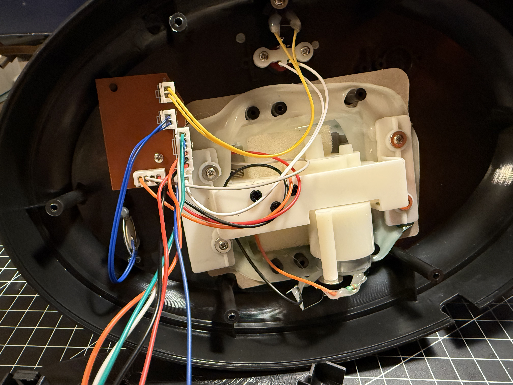
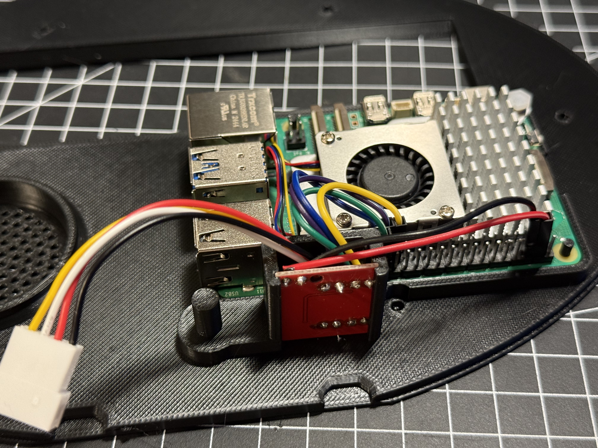
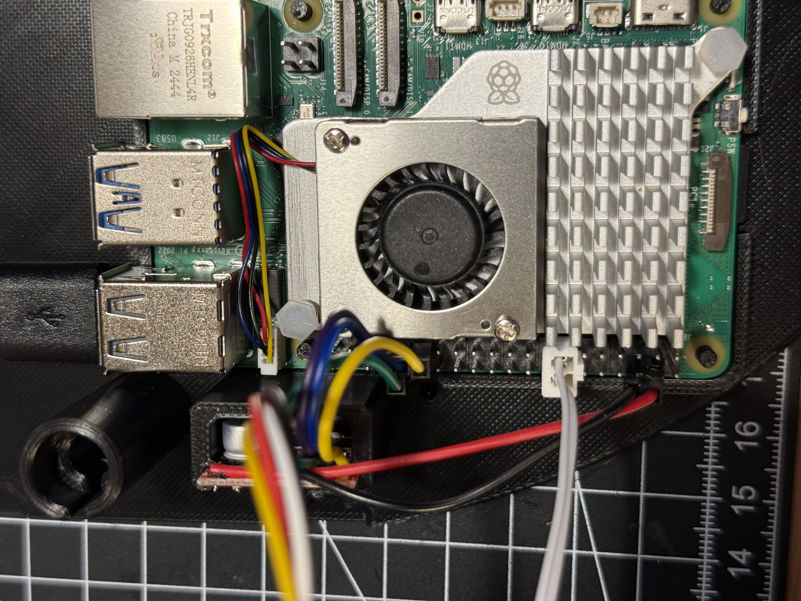

# Billy Bass Assistant – Build Instructions

This guide explains how to physically build and wire your Raspberry Pi–powered **Billy Bass Assistant**

---

## Parts List
> ✅ [3D-printed custom backplate](https://makerworld.com/en/models/1457024-ai-fish-billy-big-mouth-bass-backplate#profileId-1518677)

| Part                                         | EU                                                                                                                                          | Global                                                             |
|----------------------------------------------|---------------------------------------------------------------------------------------------------------------------------------------------|--------------------------------------------------------------------|
| Big Mouth Billy Bass                         | [Amazon](https://amzn.eu/d/gzyNRsg)                                                                                                         |                                                                    |
| Raspberry Pi 5 (4gb RAM or more recommended) | [Kiwi Electronics](https://www.kiwi-electronics.com/nl/raspberry-pi-5-computers-accessoires-415/raspberry-pi-5-4gb-11579 )                  |                                                                    |
| Raspberry Pi Power Supply 45W                | [Kiwi Electronics](https://www.kiwi-electronics.com/nl/raspberry-pi-45w-usb-c-power-supply-wit-eu-20344 )                                   |                                                                    |
| MicroSD card ( for Raspberry OS Lite)        | [Kiwi Electronics](https://www.kiwi-electronics.com/nl/transcend-64gb-microsd-met-adapter-uhs-i-u3-a2-ultra-performance-160-80-mb-s-11632 ) |                                                                    |
| 1x USB Speaker                               | [Amazon](https://amzn.eu/d/2yklfno)                                                                                                         | [AliExpress](https://nl.aliexpress.com/item/1005007168026736.html) |
| 1x USB Microphone                            | [Amazon](https://amzn.eu/d/7Y9GhoL)                                                                                                         | [AliExpress](https://nl.aliexpress.com/item/1005007211513791.html) |
| 1x L298N Motor Driver                        | [Amazon](https://amzn.eu/d/g9yBNVg)                                                                                                         | [AliExpress](https://nl.aliexpress.com/item/1005006890733953.html) |
| Jumper Wires / Dupont Cables                 | [Amazon](https://amzn.eu/d/i4kyXG2)                                                                                                         | [AliExpress](https://nl.aliexpress.com/item/1005003641187997.html) |
| *JST 2.54 4 pin connector (male)             | [Amazon](https://amzn.eu/d/i4kyXG2)                                                                                                         | [AliExpress](https://nl.aliexpress.com/item/1005007460897865.html) |

* recommended to be able to easily (un)plug the motor cables

## Tools List

- Soldering iron
- Flush cutter
- Pliers
- Screwdriver (small Philips)
- Wire stripper (recommended)
- Drill bit (~2mm diameter)
- Glue (optional)
- Double sided mounting tape or appropriate screws(for mounting french cleat)

---

## 1. Gut the Fish

- Remove the 6 philips screws in the back of the Billy and remove the original backplate. Save the screws for re-assembly later.
- Unplug all the electronic plugs, only keep the two motors + the jst plug (with Red Black White Orange wires) and the push button. Remove the tweeter (?) (disc shaped with blue wires) and the light/motion sensor (yellow wires)
- In the spot where the sensor was, the microphone will be placed so cut away the plastic extrusion until it is (somewhat) flush to the rest of the housing.
  - I used the flush cutter to cut away chunks of plastic and used the pliers to twist & turn to remove the plastic.

  
## 2. Wiring Instructions

### From Motor to Motor Driver

Solder either (90 degree corner) header pins on INT1-INT4 and + - to be able to use intact female to female jumper wires.
or cut the jumper wires keeping the female plug intact and solder the bare wire ends onto the board.

Solder the other end of the jst plug onto the board. The order is important.
In my case the colors of the plug don't match the colors of the original motor cables (see photo below), 
therefore included the JST wire color column is included. 

If you don't use the jst connector and solder the motor wires directly 
to the driver board or if you have a jst connector with different wire colors / order, 
focus only on the motor wire color and the corresponding pin on the driver board.

The table below is considered with motor driver board oriented with the Motor B and Motor A labels in the 
bottom left corner of the board. The 1-4 positions are counted from left to right.

| Motor Driver Pin (position) | Wire Color JST | Motor Wire Color |
|-----------------------------|----------------|------------------|
| Motor B (1)                 | Black          | Red              |
| Motor B (2)                 | White          | White            |
| Motor A (3)                 | Yellow         | Orange           |
| Motor A (4)                 | Red            | Black            |

### From Motor Driver to Raspberry Pi (GPIO Pinout)

Using distinct jumper wire colors is recommended for easier identification. 

| Component | GPIO Pin number (physical pin)   | Function                           |
|-----------|----------------------------------|------------------------------------|
| Motor IN1 | GPIO 13 (pin 33)                 | Head & tail direction/speed (PWM1) |
| Motor IN2 | GPIO 6  (pin 31)                 | Head &tail on/off                  |
| Motor IN1 | GPIO 12 (pin 32)                 | Mouth direction/speed (PWM0)       |
| Motor IN2 | GPIO 5  (pin 29)                 | Mouth on/off                       |
| Motor +   | 5v pwr  (pin 5)                  | Power to motor driver              |
| Motor -   | Ground  (pin 6)                  |                                    |
| Button    | GPIO 27 (pin 13) & GND (pin 14)  | Trigger voice session              |

### Speaker and mic

Using an existing usb speaker and usb microphone is the easiest route. 

Remove the Philips screw in the back of the speaker to be able to separate the front and the back of the speaker housing.
Take note / a picture of the wiring of the usb cable at the audio board (probably from left to right: Black, Green, White and Red) and cut the cable at ~ 15cm to reduce the unneeded cable length. 
Remove the wire from the back of the housing and resolder the 4 usb cables accordingly.
We only need one speaker but in the backplate there are two speaker spots: 
- one facing to the side of the housing, a couple holes need to be drilled in the original housing to create a 'speaker grill' for sound to pass through. This spot is recommended since it will place the speaker closest to the mouth of Billy.
- one facing downwards (like the original placement). This is for future-proofing in case of a different method of mounting (standalone / not flush against the wall)

Place the speaker in the speaker holder and place it onto the backplate.

Remove the top part of the microphone housing and place the microphone component itself in the 3d printed holder and place it on the backplate.
These holders should be a snug fit. If not; use a bit of glue to secure it.

In the picture above both speaker spots are used. 
The 'downward' facing speaker is only recommended when there is a bit of space for the sound between the wall and billy.
The microphone is not shown in this photo since my initial idea was to glue it in place in the original housing.
Afterwards I added the mic holder for easier assembly.

### Assemble

> Before connecting the motors and powering up the raspberry pi it is recommended to have completed at least step **3. GPIO Voltage Configuration (Motor Safety)** of the [README.md](./../README.md)

Once all the components are placed into the backplate (and everything is connected) the backplate can be mounted onto the original housing. 
Route the usb c cable through the existing hole on the top and first attach only 2 of the 6 screws.
Continue with the software installation if you haven't done so already and do a first test run of Billy. 
If everything works as expected screw in the remaining screws.

The French cleat can be mounted on the wall with screws or double sided (mounting) tape. Billy can then be placed onto the cleat.